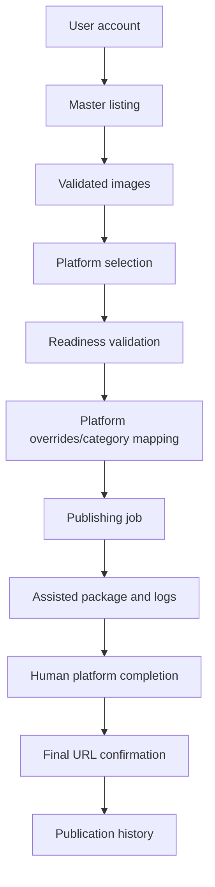

# Task Graph

## External Blockers

- Official API publishing requires provider credentials, OAuth/app approval, quota review, and platform-specific compliance work.
- Assisted workflows require the user to complete external login, CAPTCHA, payment, confirmation, and final submit steps.

