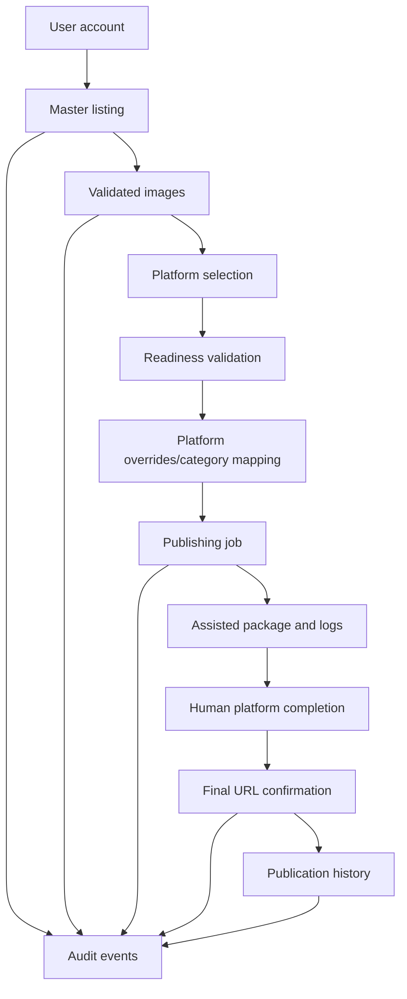

# Task Graph

Current critical path:

1. User account.
2. Listing.
3. Images.
4. Platform selection.
5. Readiness validation.
6. Platform overrides.
7. Assisted/API job.
8. Job logs.
9. Manual completion/final URL.
10. History.

Operational hardening branches:

- Diagnostics: `python -m app.doctor`, `/api/diagnostics`, redacted support bundles.
- Auditability: owner-scoped `audit_events` for privacy and state-changing actions.
- Recovery: guarded local SQLite/upload backup and restore scripts.
- UI quality: static accessibility audit for landmarks, labels, button names, image alt coverage, and live-region presence.

Blocked production branches:

- Official API publishing requires provider credentials, account approval, OAuth policy review, and secret-manager integration.
- Production disaster recovery requires the real hosting database, object storage, retention policy, encryption custody, and restore-drill approvals.

## External Blockers

- Official API publishing requires provider credentials, OAuth/app approval, quota review, and platform-specific compliance work.
- Assisted workflows require the user to complete external login, CAPTCHA, payment, confirmation, and final submit steps.
- Browser E2E, responsive screenshots, contrast checks, and assistive-technology signoff require a real browser/manual QA pass.
